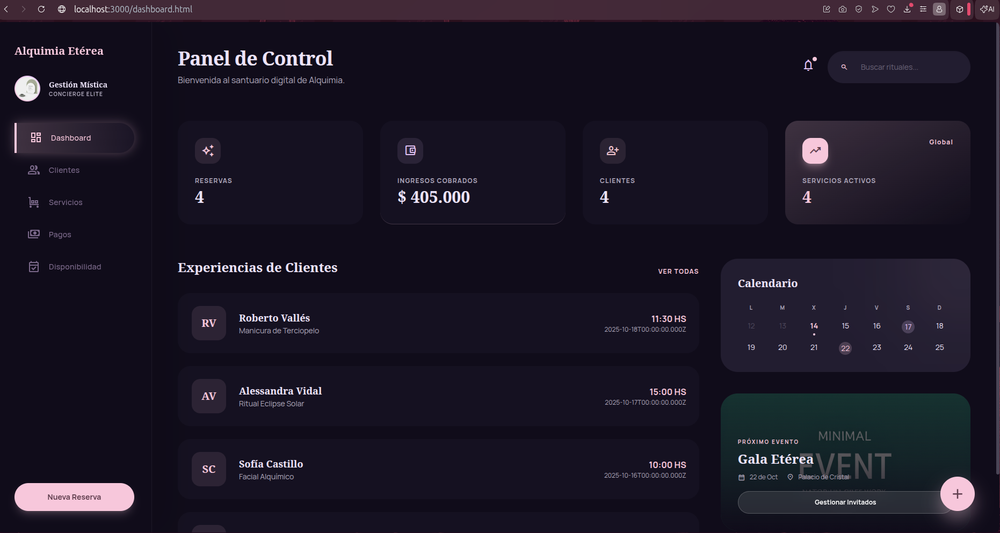
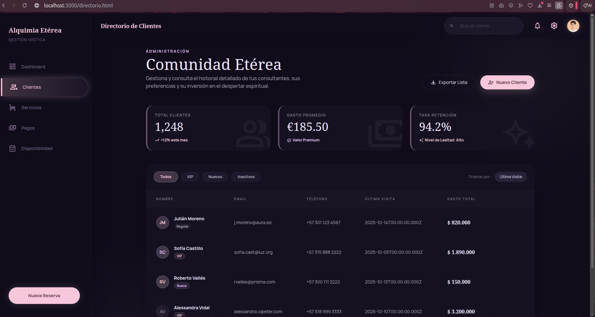
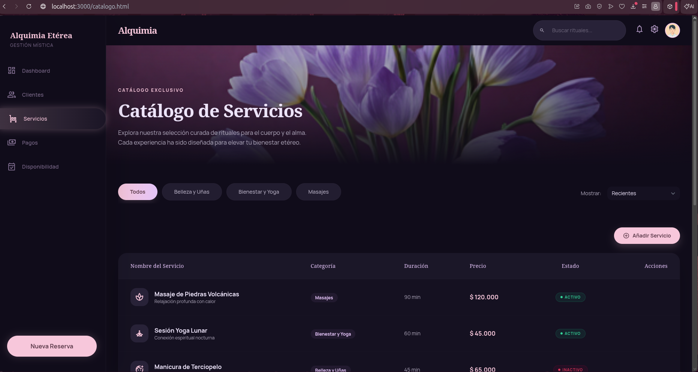
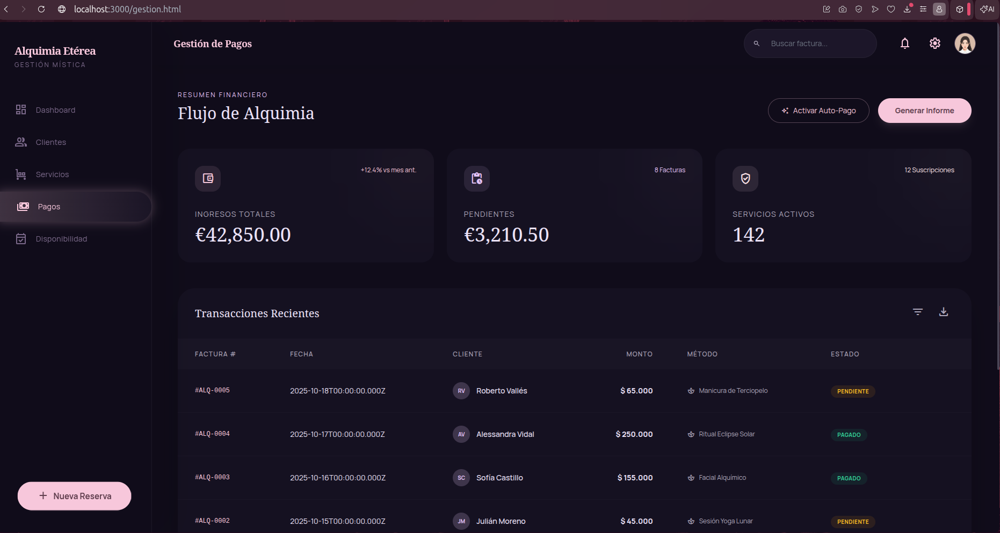
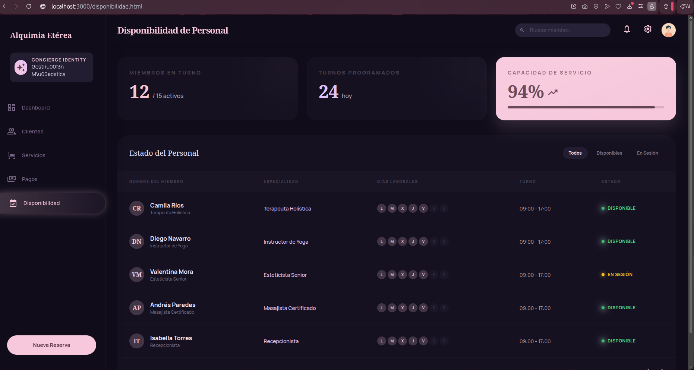
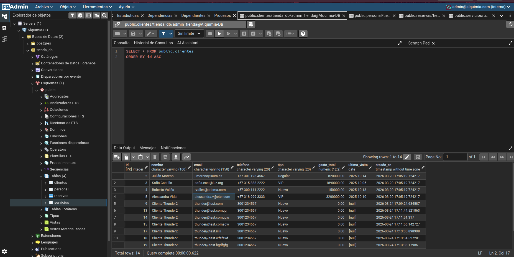
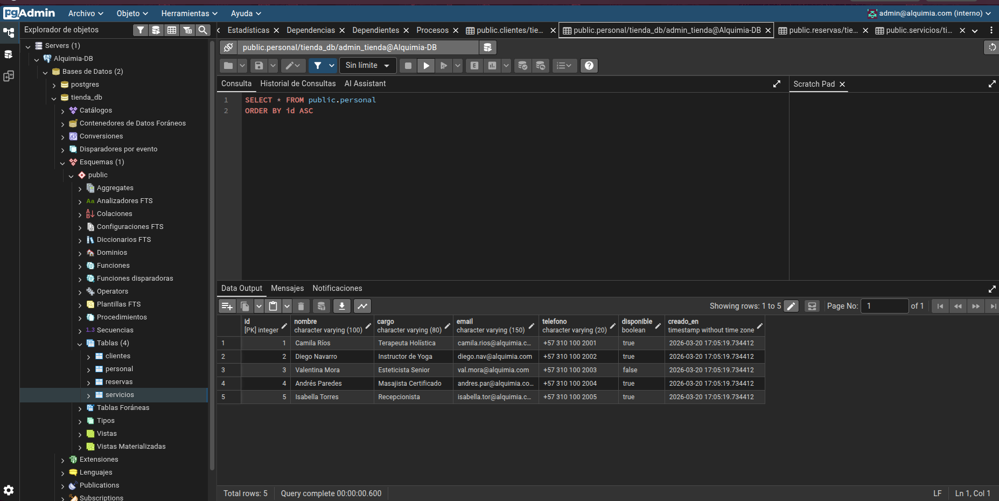
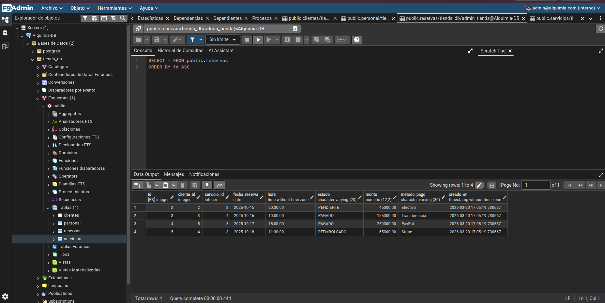
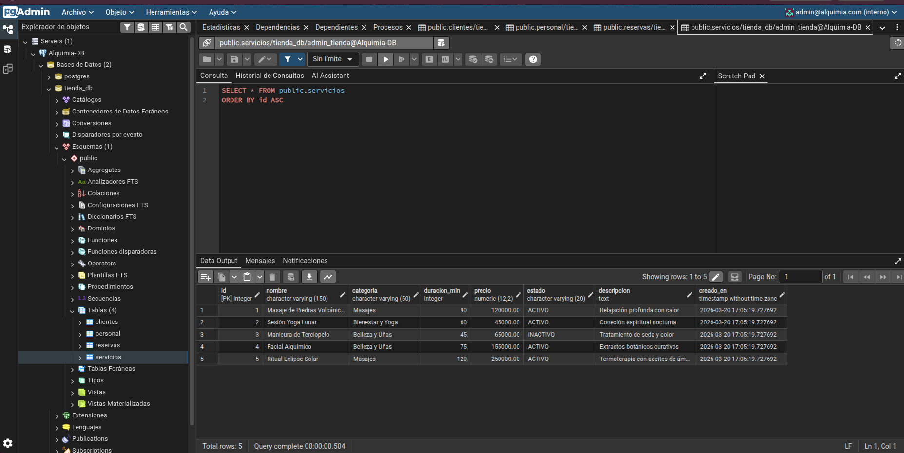

# Actividad 1: Orquestación de microservicios con Docker Compose

Este proyecto ahora usa un diseño con microservicios y un API Gateway. Incluye:

- `auth-service`: servicio de autenticación y gestión de usuarios.
- `booking-service`: servicio de clientes, servicios, reservas, personal y estadísticas.
- `api-gateway`: gateway que expone `/api/*` y enruta internamente a los microservicios.
- `frontend`: SPA servido por Nginx con proxy hacia el gateway.
- `db`: PostgreSQL 16 como base de datos.
- `pgadmin`: interfaz web de administración de PostgreSQL.

## Estructura del Proyecto

- `.env.example`: Plantilla de variables de entorno.
- `init-db/01-init.sql`: Script de creación de tablas y datos iniciales.
- `auth-service/`: servicio de autenticación.
  - `Dockerfile`: imagen Node 18 Alpine.
  - `index.js`: rutas `/api/auth/register`, `/api/auth/login` y `/api/auth/me`.
  - `package.json`: dependencias `express`, `cors`, `pg`.
- `booking-service/`: servicio de reservas y catálogo.
  - `Dockerfile`: imagen Node 18 Alpine.
  - `index.js`: CRUD de clientes, servicios, reservas y personal.
  - `package.json`: dependencias `express`, `cors`, `pg`.
- `gateway/`: API Gateway.
  - `Dockerfile`: imagen Node 18 Alpine.
  - `index.js`: proxy express con `http-proxy-middleware`.
  - `package.json`: dependencias `express`, `cors`, `http-proxy-middleware`.
- `frontend/`: cliente web servido por Nginx.
  - `Dockerfile`, `nginx.conf`, HTML y JS estáticos.

## Instrucciones de Uso

### 1. Configurar el entorno
Antes de levantar el proyecto, crea el archivo `.env` desde el ejemplo:
```bash
cp .env.example .env
```

### 2. Levantar el proyecto
Navega a la raíz del proyecto y ejecuta:
```bash
docker compose up -d --build
```

### 3. Acceso a los servicios

| Servicio | URL | Puerto |
| :--- | :--- | :--- |
| **Frontend UI** | http://localhost:3000 | `3000` |
| **API Gateway** | http://localhost:5000 | `5000` |
| **pgAdmin 4** | http://localhost:8080 | `8080` |

### 4. Endpoints principales

- `/api/auth/register`
- `/api/auth/login`
- `/api/auth/me`
- `/api/clientes`
- `/api/servicios`
- `/api/reservas`
- `/api/personal`
- `/api/stats`

## Características Implementadas (CRUD)

El proyecto incluye la implementación completa de operaciones **CRUD** para las dos entidades principales, permitiendo la gestión dinámica desde la interfaz de usuario:

1.  **Módulo Clientes (Comunidad)**:
    *   **Create**: Modal "Nuevo Cliente" para registrar consultantes.
    *   **Read**: Listado dinámico con filtros por tipo (VIP, Regular, Nuevo).
    *   **Update**: Edición de datos existentes (Nombre, Email, Teléfono, Tipo).
    *   **Delete**: Eliminación permanente de registros con confirmación.
2.  **Módulo Servicios (Rituales)**:
    *   **CRUD Completo**: Gestión total del catálogo de masajes y bienestar, incluyendo precios en pesos colombianos (COP).
3.  **Visualización Adicional**: Dashboard con KPIs dinámicos, historial de pagos (reservas) y disponibilidad de personal.

---
# Estado de los contenedores


# API respondiendo
 # Get


 # Post


 # Put


 # Delete


# Frontend










# pgAdmin 4
 

 

 

 